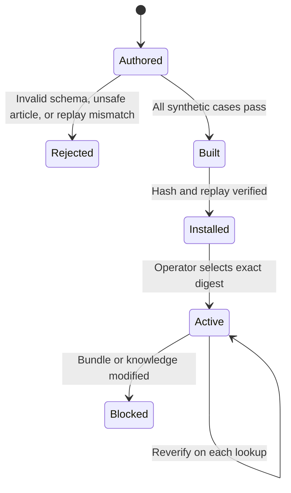

# A2Z Resolution Network

An inspectable, content-addressed support-pack pipeline. Product and support teams can version approved knowledge with synthetic English and Arabic replay cases, build a pack, install it into a private local registry, and select a verified knowledge snapshot for [A2Z LiveOps Hub](https://github.com/AAH20/a2z-liveops-hub). The pack uses the conservative [A2Z Resolution Engine](https://github.com/AAH20/a2z-resolution-engine), whose answer path returns approved article text verbatim or escalates.

**Status:** first OSS slice, not a public marketplace. The bundled example is fictional. There are no customer installations, live tickets, publisher identities, cryptographic signatures, hosted registry, payments, or measured customer outcomes in this repo. A content hash detects accidental or local tampering; it does **not** authenticate a publisher.


## What ships

- A strict pack manifest with ID, immutable semantic version, maintainer label, license, evidence class, and pinned Resolution Engine source commit.
- Approved knowledge in the Resolution Engine's `schema_version: 1.0` format.
- A synthetic replay suite requiring an English answer, Arabic answer, and escalation. Every declared label must match the engine's result before build or install succeeds.
- An immutable local registry: one `(pack ID, version)` can map to one content hash. Activation selects a digest for one pseudonymous customer key; `active` rechecks the bundle and installed knowledge.
- A reusable `knowledge_path` that can be passed directly to LiveOps Hub. No pack operation posts a ticket or sends a customer message.



## Run the synthetic example

Use Python 3.11+ and clone the pinned engine and this repository side by side. Installing the engine source provides the imported validator and replay evaluator. The build additionally checks the checkout's Git commit against the pack manifest.

```bash
git clone https://github.com/AAH20/a2z-resolution-engine.git
git clone https://github.com/AAH20/a2z-resolution-network.git
cd a2z-resolution-engine
git checkout 5aa314fb1b2b24cb0a90d6b3a64d5af83b49c5c2
cd ..
python3 -m pip install -e ./a2z-resolution-engine -e ./a2z-resolution-network
cd a2z-resolution-network
a2z-resolution-network build examples/guide-pack \
  --engine-source ../a2z-resolution-engine \
  --output /tmp/synthetic-product-guide.a2zpack
a2z-resolution-network verify /tmp/synthetic-product-guide.a2zpack
mkdir -m 700 -p /tmp/a2z-resolution-registry
a2z-resolution-network install /tmp/synthetic-product-guide.a2zpack \
  --registry /tmp/a2z-resolution-registry
```

Copy the installed pack's `id`, `version`, and `sha256` from the command output:

```bash
a2z-resolution-network activate --registry /tmp/a2z-resolution-registry \
  --customer synthetic-pilot --id synthetic-product-guide --version 0.1.0 \
  --sha256 dd8cc6c016f62ff4fbb5e7a1cd09830125510ade32e15ead370bc2c3667f5210
a2z-resolution-network active --registry /tmp/a2z-resolution-registry \
  --customer synthetic-pilot
```

Use the returned `knowledge_path` as LiveOps Hub's `--knowledge` argument. Use separate private registries and engine databases for different customer organizations. LiveOps Hub remains responsible for human review, Zendesk authorization, sending, and operator-declared outcomes.

## Pack contract

| File | Role | Published demo rule |
| --- | --- | --- |
| `manifest.json` | Identity, version, declared engine commit | `SYNTHETIC_ONLY` evidence class |
| `knowledge.json` | Approved answer sources | HTTPS source, explicit approval and expiry |
| `suite.json` | Replay tickets and declared expectations | Invented cases in English and Arabic |
| `.a2zpack` | Content-hashed envelope and replay report | Plain JSON; inspectable without this CLI |

Synthetic replay accuracy is **not** a customer resolution rate. The example's modeled costs and declared acceptance fields are teaching data, not actual economics. An operator can replace a pack only by issuing a new version. The local registry rejects a different digest under the same ID and version.

## Distribution and production path

The immediate next proof is an external support team installing a pack and repeatedly using it on authorized tickets through LiveOps Hub. A multi-customer distribution service would additionally need verified publisher identities and signed artifacts, independent review, tenant isolation, secure OAuth onboarding, key rotation, revocation, upgrade and rollback UX, consented telemetry, customer-outcome evidence, support processes, and third-party security review. Zendesk requires a **global OAuth client** for a public or integration app distributed to multiple customers; its [developer documentation](https://developer.zendesk.com/documentation/marketplace/building-a-marketplace-app/set-up-a-global-oauth-client/) describes that requirement. Do not treat the local pilot token pattern as a marketplace authorization design.

The commercial hypothesis is managed installation, validated pack maintenance, and connector operations. Price only after measuring real operator effort, support burden, active installations, repeat usage, and customer-confirmed outcomes. No exponential-growth or market-share claim is made by this prototype.

## Development

```bash
python3 -m unittest discover -s tests -v
```

See [SECURITY.md](SECURITY.md). Apache-2.0.
